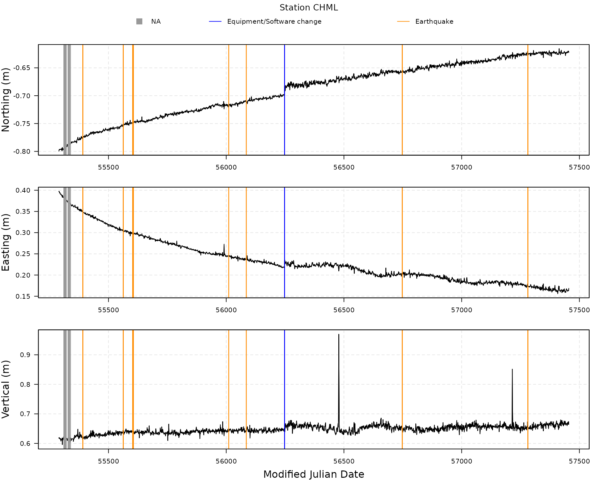
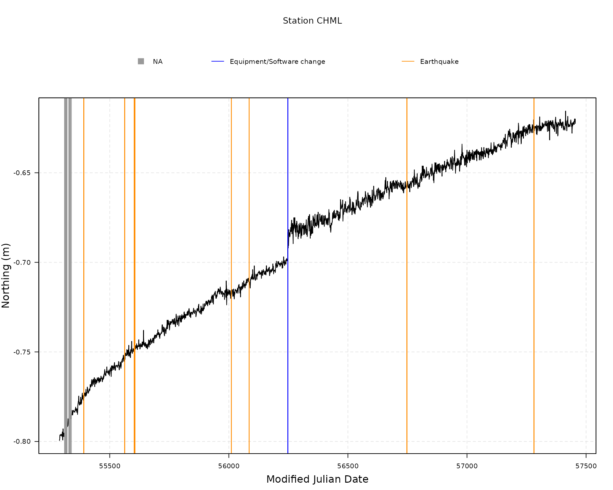
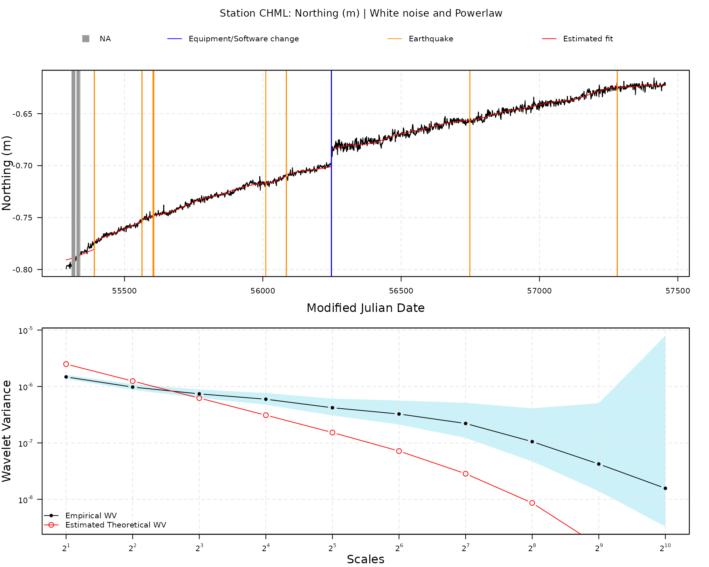
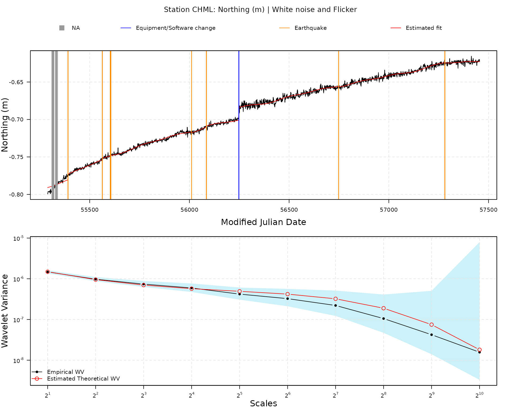

# Estimate a model

## Model and estimator

The `gmwmx2` `R` package allows to estimate linear model with correlated
residuals in presence of missing data.

More precisely, we assume the following model: \\\begin{equation}
\boldsymbol{Y} = \boldsymbol{X} \boldsymbol{\beta} +
\boldsymbol{\varepsilon}, \quad \boldsymbol{\varepsilon} \sim
\mathcal{F}\left\\\boldsymbol{\Sigma}\left(\boldsymbol{\gamma}\right)\right\\,
\end{equation}\\

where \\\boldsymbol{X} \in \mathbb{R}^{n \times p}\\ is a design matrix
of observed predictors, \\\boldsymbol{\beta} \in \mathbb{R}^p\\ is the
regression parameter vector and \\\boldsymbol{\varepsilon} =
\\\varepsilon\_{i}\\\_{i=1,\ldots,n}\\ is a zero-mean process following
an unspecified joint distribution \\\mathcal{F}\\ with positive-definite
covariance function \\\boldsymbol{\Sigma}(\boldsymbol{\gamma}) \in
\mathbb{R}^{n\times n}\\ characterizing the second-order dependence
structure of the process and parameterized by the vector
\\\boldsymbol{\gamma} \in \boldsymbol{\Gamma} \subset \mathbb{R}^q\\.

We then define the a random variable \\\boldsymbol{Z}
=\\Z\_{i}\\\_{i=1,\ldots,n}\\ which describes the missing observation
mechanism. More specifically, the vector \\\boldsymbol{Z} \in \\0,
1\\^n\\ is a binary-valued stationary process independent of
\\\boldsymbol{Y}\\ with expectation \\\mu(\boldsymbol{\vartheta}) =
\mathbb{E}\[Z_i\] \in \[0, \\ 1)\\, \\\forall \\ i\\, and covariance
matrix \\\boldsymbol{\Lambda}(\boldsymbol{\vartheta}) =
\mathbb{V}\[\boldsymbol{Z}\] \in \mathbb{R}^{n\times n}\\ whose
structure is assumed known up to the parameter vector
\\\boldsymbol{\vartheta} \in \boldsymbol{\Upsilon} \subset
\mathbb{R}^k\\

We then assume that we only observe the stochastic process
\\\tilde{\boldsymbol{Y}} = \boldsymbol{Z} \odot \boldsymbol{Y}\\, where
\\\odot\\ denotes the Hadamard product. Hence, \\\tilde{\boldsymbol{Y}}
\in \mathbb{R}^n = \boldsymbol{Y} \odot \boldsymbol{Z}\\ represents the
observed process vector with null elements in the positions where
observations are missing.

Using \\\otimes\\ to denote the Kronecker product, we then define
\\\tilde{\boldsymbol{X}} = \boldsymbol{Z} \otimes \boldsymbol{1}^T \odot
\boldsymbol{X} \in \mathbb{R}^{n \times p}\\ as the design matrix
\\\boldsymbol{X}\\ with zero-valued vectors for the rows where
observations are missing in \\\boldsymbol{Y}\\ (where \\\boldsymbol{1}\\
represents a vector of ones of dimension \\p\\).

We estimate the parameters \\\boldsymbol{\beta}\\ with the least square
estimator:

\\\begin{equation} \hat{\boldsymbol{\beta}} =
\left(\tilde{\boldsymbol{X}}^T \tilde{\boldsymbol{X}}\right)^{-1}
\tilde{\boldsymbol{X}}^T \tilde{\boldsymbol{Y}}. \end{equation}\\

We compute the estimated residuals as \\\hat{\boldsymbol{\varepsilon}} =
{\tilde{\boldsymbol{Y}}} - \tilde{{\boldsymbol{X}}}
\hat{\boldsymbol{\beta}}\\.

We then estimate with the Maximum Likelihood Estimator the parameters
\\\boldsymbol{\vartheta}\\ of the missingness process \\\boldsymbol{Z}\\
assuming that \\\boldsymbol{Z}\\ is generated from a Markov model with
the following transition probabilities:

\\\begin{equation} \label{eq:markov_model_def} \begin{aligned} & P\left(
Z_2=1 \mid Z_1=1\right)=1 - p_1 \\ & P\left(Z_2=1 \mid Z_1=0\right) =
p_2 \\ & P\left(Z_2=0 \mid Z_1=1\right)=p_1 \\ & P\left(Z_2=0 \mid
Z_1=0\right)=1-p_2. \end{aligned} \end{equation}\\

We then estimate the parameters \\\boldsymbol{\gamma}\\ using a
Generalized method of Wavelet Moments approach (Guerrier et al. 2013)
and using the fact that the variance-covariance matrix of
\\\hat{\boldsymbol{\varepsilon}}\\ is given by:

\\\boldsymbol{\Sigma}\_{\hat{\boldsymbol{\varepsilon}}}(\boldsymbol{\gamma})
= \[\boldsymbol{\Lambda}(\hat{\boldsymbol{\vartheta}}) +
\mu(\hat{\boldsymbol{\vartheta}})^2 \mathbf{1} \mathbf{1}^T \] \odot (
\boldsymbol{I} - \boldsymbol{P})\boldsymbol{\Sigma}(\boldsymbol{\gamma})
(\boldsymbol{I} - \boldsymbol{P})\\

where \\\boldsymbol{P} =
\boldsymbol{X}(\boldsymbol{X}^T\boldsymbol{X})^{-1}\boldsymbol{X}^T\\
and \\\boldsymbol{I}\\ is the identity matrix of dimension \\n\times
n\\.

More precisely, we rely on the result of Xu et al. (2017) that provide a
computationally efficient form of the theoretical Allan variance
(equivalent to the Haar wavelet variance up to a constant) for zero-mean
stochastic processes such as \\\boldsymbol{\varepsilon}\\ to avoid
computing these large matrices multiplication in the objective function.
Indeed in Xu et al. (2017) they generalize the results in Zhang (2008)
to zero-mean non-stationary processes by using averages of the diagonals
and super-diagonals of the covariance matrix of
\\\boldsymbol{\varepsilon}\\. What this implies is that the GMWM, which
uses this form, does not require the storage of the \\n \times n\\
covariance matrix of \\\boldsymbol{\varepsilon}\\, but only of a vector
of dimension \\n\\ which is then plugged into an explicit formula
consisting in a linear combination of the elements of this vector (these
elements being averages of the diagonal and super-diagonals of the
covariance matrix).

## Estimating tectonic velocities and crustal uplift

While the GMWMX as described above and in more details in Voirol et al.
(2024), is a general method for estimating large linear model with
complex dependence structure in presence of missing data, the `gmwmx2`
`R` package is currently developed specifically to estimate tectonic
velocities from position times series in graticule distance coordinates
system (GD) provided by the Nevada geodetic Laboratory (Blewitt 2024;
Blewitt, Hammond, and Kreemer 2018).

### Trajectory model

To estimate the trajectory model (see e.g., Bevis and Brown (2014) for
more details), we construct the design matrix \\\boldsymbol{X}\\ such
that \\i\\-th component of the vector \\\mathbf{X}
{{\boldsymbol{\beta}}}\\ can be described as follows with \\t_i\\
representing the \\i^{th}\\ ordered time point (epoch) indicated in
Modified Julian Date and \\t_0\\ representing the reference epoch
located exactly in the middle of start and end point of the time series:

\\\begin{split} \mathbb{E}\[\mathbf{Y}\_i\] &= \mathbf{X}\_i^T
{{\boldsymbol{\beta}}} \\ &= a + b \left(t\_{i} - t_0\right) +
\sum\_{h=1}^{m}\left\[c\_{h} \sin \left(2 \pi f\_{h} t\_{i}\right) + d_h
\cos \left(2 \pi f_h t_i\right)\right\] + \\& \sum\_{j=1}^{r}e_j
H\left(t_i - t_j\right) + \sum\_{k = 1 }^{s} l_k \left\[1-
\exp\left(\frac{-(t_i-t_k)}{\tau_k}\right)\right\]H\left(t\_{i}-\tau_k\right)
\end{split}\\

where \\a\\ is the initial position at the reference epoch \\t_0\\,
\\b\\ is the velocity parameter, \\c_h\\ and \\d_h\\ are the periodic
motion parameters (\\h = 1\\ and \\h = 2\\ represent the annual and
semi-annual seasonal terms, respectively with \\f_1 = \frac{1}{365.25}\\
and \\f_2 = \frac{2}{365.25}\\). The offset terms models earthquakes,
equipment changes or human intervention in which \\e_j\\ is the
magnitude of the step at epochs \\t_j\\, \\r\\ is the total number of
offsets, \\H\\ is the Heaviside step function defined as \\H(x):=
\begin{cases}1, & x \geq 0 \\ 0, & x\<0\end{cases}\\ and the last term
allow to model post-seismic deformation (see e.g., Sobrero et al.
(2020)) where \\s\\ is the number of post seismic relaxation time
specified, \\t_k\\ is the time when the relaxation \\k\\ starts in
Modified Julian Date (MJD), \\\tau_k\\ is the relaxation period in days
for the post-seismic relaxation \\k\\ and \\l_k\\ is the amplitude of
the transient. Note that by default the estimates of the functional
parameters are provided in unit/day.

When loading data from a specific station using the function
[`gmwmx2::download_station_ngl()`](../reference/download_station_ngl.md),
we extract from the Nevada Geodetic Laboratory the position time series
in GD coordinates, the time steps associated with a equipment or
software change and the time steps associated with an earthquake near
the station. All these objects are stored in a object of class
`gnss_ts_ngl`.

When applying the function [`gmwmx2::gmwmx2()`](../reference/gmwmx2.md)
to an object of class `gnss_ts_ngl`, we construct the design matrix
\\\boldsymbol{X}\\ by considering an offset term for all equipment or
software changes steps and all earthquakes indicated by the NGL. We also
specify a post-seismic relaxation term for all earthquakes indicated by
the NGL. If no relaxation time is specified in the argument
`vec_earthquakes_relaxation_time`, we consider a default relaxation time
of \\365.25\\ days.

### Stochastic model

It is generally recognized that noise in GNSS time series is best
described by a combination of colored noise plus white noise (He et al.
2017; Langbein 2008; Williams et al. 2004; Bos et al. 2013) where the
white noise generally model noise at high frequencies and the colored
noise model the lower frequencies of the spectrum. In a large study on
the noise properties of GNSS signals, concluded that the optimal noise
models for 80–90% of GNSS time series signals are the power law and
white noise model or white noise and flicker/pink noise with model. The
package currently support both stochastic model specification.

More precisely, the power spectrum of a power-law noise has the
following form: \\ P(f)=P_0\left(f / f_s\right)^\kappa \\ where \\f\\ is
the frequency, \\P_0\\ is a constant, \\f_s\\ the sampling frequency and
the exponent \\\kappa\\ is called the spectral index.

Many stochastic noise can be expressed as such, for example, a spectral
index \\\kappa=0\\ produces a white noise, a spectral index
\\\kappa=-2\\ produces a red noise or random walk and a spectral index
\\\kappa=-1\\ produce a flicker noise, also called pink noise.

Granger (1980) and Hosking (1981) showed that power-law noise with a
spectral index between \\-1\\ and \\1\\ can be obtained by using
fractional differencing of Gaussian noise:

\\ (1-B)^{-\kappa / 2} \mathbf{v} \\

where \\B\\ is the backward-shift operator \\\left(B
v_i=v\_{i-1}\right)\\ and \\\mathbf{v}\\ a vector with independent and
identically distributed (IID) Gaussian noise.

Following from Hosking’s definition of the fractional differencing, we
obtain

\\ \begin{aligned} (1-B)^{-\kappa / 2} &
=\sum\_{i=0}^{\infty}\binom{-\kappa / 2}{i}(-B)^i \\ &
=1-\frac{\kappa}{2} B-\frac{1}{2}
\frac{\kappa}{2}\left(1-\frac{\kappa}{2}\right) B^2+\ldots \\ &
=\sum\_{i=0}^{\infty} h_i \end{aligned} \\ with the coefficient \\h_i\\
that can be computed using the following recurrence relation (Kasdin and
Walter 1992):

\\ \begin{aligned} h_0 & =1 \\ h_i & =\left(i-\frac{\kappa}{2}-1\right)
\frac{h\_{i-1}}{i} \quad \text { for } i\>0 \end{aligned} \\

Assuming an infinite sequence of zero-mean white noise \\\mathbf{v}\\,
with variance \\\sigma\_{P L}^2\\, and a spectral index \\kappa \> -1\\
then the autocovariance \\\gamma(\tau)=\operatorname{Cov}\left(X_t,
X\_{t+\tau}\right)=\mathbb{E}\left\[\left(X_t-\mu\right)\left(X\_{t+\tau}-\mu\right)\right\]\\
is (Bos et al. 2008):

\\ \begin{aligned} & \gamma(0)=\sigma\_{p l}^2
\frac{\Gamma(1-\alpha)}{\left(\Gamma\left(1-\frac{\alpha}{2}\right)\right)^2}
\\ &
\gamma(\tau)=\frac{\frac{\alpha}{2}+\tau-1}{-\frac{\alpha}{\alpha}+\tau}
\gamma(\tau-1) \text { for } \tau\>0 \end{aligned} \\ When the argument
`stochastic_model` is set to `"wn + pl"`, the stochastic model
considered includes both white noise and power-law with the specified
above stationary autocovariance structure. The parameters estimated are:
\\\sigma^2\_{W N}\\, \\\kappa\\ (constrained to be greater than \\-1\\)
and \\\sigma^2\_{P L}\\.

When the argument `stochastic_model` is set to `"wn + fl"`, the
stochastic model considered includes both white noise and flicker noise
(not stationary power-law noise with a spectral index \\\kappa=-1\\)
where the variance covariance of the flicker noise \\\omega\\ is
obtained as follows (see e.g., (Bos et al. 2008)):

\\ \operatorname{Cov}(\omega) = \sigma^2\_{F L}\mathbf{U}^T \mathbf{U}
\\

where \\ \mathbf{U}=\left(\begin{array}{cccc} h_0 & h_1 & \ldots & h_n
\\ 0 & h_0 & & h\_{n-1} \\ \vdots & & \ddots & \vdots \\ 0 & 0 & \ldots
& h_0 \end{array}\right) \\ with the coefficients \\h_i\\ computed
considering a spectral index \\\kappa=-1\\.

The stochastic parameters estimated are: \\\sigma^2\_{W N}\\,
\\\sigma^2\_{F L}\\ and \\\kappa\\ is fixed to \\-1\\.

## Example of estimation

Let us showcase how to estimate the tectonic velocity in for one
specific component (North, East or Vertical) of one station.

Let us first load the `gmwmx2` package.

``` r
library(gmwmx2)
```

## Download a station from Nevada Geodetic Laboratory

``` r
station_data <- download_station_ngl("CHML")
```

## Plot Station

``` r
plot(station_data)
```



## Plot Northing component

``` r
plot(station_data, component = "N")
```



## Estimate model on station data

``` r
fit1 <- gmwmx2(station_data, n_seasonal = 2, component = "N", stochastic_model = "wn + pl")
```

## Extract estimated parameters

``` r
summary(fit1)
```

    ## Summary of Estimated Model
    ## -------------------------------------------------------------
    ## Functional parameters
    ## -------------------------------------------------------------
    ## Parameter                  Estimate  Std_Deviation  95% CI Lower  95% CI Upper
    ## -------------------------------------------------------------
    ## Intercept               -0.70909375   0.00173188  -0.71248817  -0.70569934
    ## Trend                    0.00007383   0.00000165   0.00007059   0.00007707
    ## Sin (Annual)            -0.00066336   0.00006842  -0.00079746  -0.00052927
    ## Cos (Annual)             0.00077064   0.00007417   0.00062527   0.00091602
    ## Sin (Semi-Annual)        0.00073582   0.00006210   0.00061410   0.00085754
    ## Cos (Semi-Annual)       -0.00030933   0.00006314  -0.00043309  -0.00018557
    ## Jump: MJD 56248          0.01697696   0.00038277   0.01622675   0.01772718
    ## Jump: MJD 55391          0.00754302   0.00038771   0.00678312   0.00830292
    ## Jump: MJD 55563          0.00163803   0.00064910   0.00036583   0.00291024
    ## Jump: MJD 55603          0.00276825   0.00178919  -0.00073850   0.00627499
    ## Jump: MJD 55606          0.00077484   0.00283239  -0.00477654   0.00632623
    ## Jump: MJD 56011         -0.00118520   0.00048797  -0.00214160  -0.00022881
    ## Jump: MJD 56085          0.00127046   0.00049789   0.00029461   0.00224631
    ## Jump: MJD 56748         -0.00068122   0.00024164  -0.00115484  -0.00020761
    ## Jump: MJD 57281         -0.00035896   0.00037781  -0.00109946   0.00038154
    ## Earthquake: MJD 55391    0.01819421   0.00163822   0.01498337   0.02140505
    ## Earthquake: MJD 55563    0.00092715   0.00985944  -0.01839699   0.02025129
    ## Earthquake: MJD 55603   -0.37283777   0.47935470  -1.31235572   0.56668017
    ## Earthquake: MJD 55606    0.36328081   0.47535555  -0.56839895   1.29496057
    ## Earthquake: MJD 56011    0.00451098   0.00415732  -0.00363722   0.01265918
    ## Earthquake: MJD 56085   -0.01897612   0.00361553  -0.02606243  -0.01188982
    ## Earthquake: MJD 56748   -0.00957194   0.00096029  -0.01145406  -0.00768981
    ## Earthquake: MJD 57281   -0.02302075   0.00142093  -0.02580572  -0.02023577
    ## -------------------------------------------------------------
    ## Stochastic parameters
    ## -------------------------------------------------------------
    ##  White Noise Variance  :     0.00000503
    ##  Stationary powerlaw Spectral index:     0.99999862
    ##  Stationary powerlaw Variance:     0.00000000
    ## -------------------------------------------------------------
    ## Missingness parameters
    ## -------------------------------------------------------------
    ##  P(Z_{i+1} = 0 | Z_{i} = 1): 0.00279460
    ##  P(Z_{i+1} = 1 | Z_{i} = 0): 0.31578947
    ##  \hat{E[Z]}: 0.99122807
    ## -------------------------------------------------------------
    ## Running time: 0.74 seconds
    ## -------------------------------------------------------------

By default, the estimated parameters are provided in m/day, we can
optionally scale the estimated functional parameters so that they are
returned in m/year with the argument `scale_parameters`.

``` r
summary(fit1, scale_parameters = TRUE)
```

    ## Summary of Estimated Model
    ## -------------------------------------------------------------
    ## Functional parameters
    ## -------------------------------------------------------------
    ## Parameter                  Estimate  Std_Deviation  95% CI Lower  95% CI Upper
    ## -------------------------------------------------------------
    ## Intercept              -258.99649344   0.63256737 -260.23630270 -257.75668417
    ## Trend                    0.02696692   0.00060436   0.02578239   0.02815145
    ## Sin (Annual)            -0.24229327   0.02498969  -0.29127217  -0.19331437
    ## Cos (Annual)             0.28147693   0.02709174   0.22837810   0.33457575
    ## Sin (Semi-Annual)        0.26875991   0.02268320   0.22430166   0.31321816
    ## Cos (Semi-Annual)       -0.11298102   0.02306338  -0.15818441  -0.06777764
    ## Jump: MJD 56248          6.20083621   0.13980687   5.92681979   6.47485263
    ## Jump: MJD 55391          2.75508821   0.14161195   2.47753390   3.03264253
    ## Jump: MJD 55563          0.59829213   0.23708305   0.13361790   1.06296637
    ## Jump: MJD 55603          1.01110216   0.65350145  -0.26973715   2.29194146
    ## Jump: MJD 55606          0.28301205   1.03453045  -1.74463038   2.31065448
    ## Jump: MJD 56011         -0.43289581   0.17822922  -0.78221867  -0.08357296
    ## Jump: MJD 56085          0.46403594   0.18185540   0.10760590   0.82046598
    ## Jump: MJD 56748         -0.24881736   0.08826043  -0.42180462  -0.07583011
    ## Jump: MJD 57281         -0.13111171   0.13799620  -0.40157930   0.13935587
    ## Earthquake: MJD 55391    6.64543546   0.59835815   5.47267502   7.81819589
    ## Earthquake: MJD 55563    0.33864093   3.60115960  -6.71950219   7.39678406
    ## Earthquake: MJD 55603  -136.17899727 175.08430306 -479.33792553 206.97993099
    ## Earthquake: MJD 55606  132.68831606 173.62361459 -207.60771540 472.98434753
    ## Earthquake: MJD 56011    1.64763593   1.51846100  -1.32849294   4.62376480
    ## Earthquake: MJD 56085   -6.93102876   1.32057171  -9.51930174  -4.34275578
    ## Earthquake: MJD 56748   -3.49614936   0.35074412  -4.18359521  -2.80870352
    ## Earthquake: MJD 57281   -8.40832800   0.51899526  -9.42554002  -7.39111599
    ## -------------------------------------------------------------
    ## Stochastic parameters
    ## -------------------------------------------------------------
    ##  White Noise Variance  :     0.00000503
    ##  Stationary powerlaw Spectral index:     0.99999862
    ##  Stationary powerlaw Variance:     0.00000000
    ## -------------------------------------------------------------
    ## Missingness parameters
    ## -------------------------------------------------------------
    ##  P(Z_{i+1} = 0 | Z_{i} = 1): 0.00279460
    ##  P(Z_{i+1} = 1 | Z_{i} = 0): 0.31578947
    ##  \hat{E[Z]}: 0.99122807
    ## -------------------------------------------------------------
    ## Running time: 0.74 seconds
    ## -------------------------------------------------------------

## Plot estimated model

``` r
plot(fit1)
```



``` r
fit2 <- gmwmx2(station_data, n_seasonal = 2, component = "N", stochastic_model = "wn + fl")
```

``` r
summary(fit2)
```

    ## Summary of Estimated Model
    ## -------------------------------------------------------------
    ## Functional parameters
    ## -------------------------------------------------------------
    ## Parameter                  Estimate  Std_Deviation  95% CI Lower  95% CI Upper
    ## -------------------------------------------------------------
    ## Intercept               -0.70909375   0.01066519  -0.72999715  -0.68819036
    ## Trend                    0.00007383   0.00001016   0.00005391   0.00009375
    ## Sin (Annual)            -0.00066336   0.00040724  -0.00146153   0.00013481
    ## Cos (Annual)             0.00077064   0.00042793  -0.00006809   0.00160938
    ## Sin (Semi-Annual)        0.00073582   0.00026087   0.00022454   0.00124711
    ## Cos (Semi-Annual)       -0.00030933   0.00027063  -0.00083974   0.00022109
    ## Jump: MJD 56248          0.01697696   0.00179981   0.01344939   0.02050453
    ## Jump: MJD 55391          0.00754302   0.00171565   0.00418040   0.01090564
    ## Jump: MJD 55563          0.00163803   0.00178150  -0.00185363   0.00512970
    ## Jump: MJD 55603          0.00276825   0.00219231  -0.00152859   0.00706509
    ## Jump: MJD 55606          0.00077484   0.00332771  -0.00574734   0.00729703
    ## Jump: MJD 56011         -0.00118520   0.00180644  -0.00472576   0.00235535
    ## Jump: MJD 56085          0.00127046   0.00187483  -0.00240414   0.00494506
    ## Jump: MJD 56748         -0.00068122   0.00176286  -0.00413637   0.00277393
    ## Jump: MJD 57281         -0.00035896   0.00176295  -0.00381428   0.00309635
    ## Earthquake: MJD 55391    0.01819421   0.00873109   0.00108158   0.03530684
    ## Earthquake: MJD 55563    0.00092715   0.02591243  -0.04986029   0.05171458
    ## Earthquake: MJD 55603   -0.37283777   0.48867274  -1.33061874   0.58494319
    ## Earthquake: MJD 55606    0.36328081   0.48325352  -0.58387868   1.31044030
    ## Earthquake: MJD 56011    0.00451098   0.01414518  -0.02321306   0.03223502
    ## Earthquake: MJD 56085   -0.01897612   0.01363705  -0.04570426   0.00775201
    ## Earthquake: MJD 56748   -0.00957194   0.00680936  -0.02291803   0.00377416
    ## Earthquake: MJD 57281   -0.02302075   0.00761179  -0.03793957  -0.00810192
    ## -------------------------------------------------------------
    ## Stochastic parameters
    ## -------------------------------------------------------------
    ##  White Noise Variance  :     0.00000159
    ##  Flicker Noise Variance:     0.00000224
    ## -------------------------------------------------------------
    ## Missingness parameters
    ## -------------------------------------------------------------
    ##  P(Z_{i+1} = 0 | Z_{i} = 1): 0.00279460
    ##  P(Z_{i+1} = 1 | Z_{i} = 0): 0.31578947
    ##  \hat{E[Z]}: 0.99122807
    ## -------------------------------------------------------------
    ## Running time: 0.76 seconds
    ## -------------------------------------------------------------

``` r
plot(fit2)
```



## References

Bevis, Michael, and A. Brown. 2014. “Trajectory Models and Reference
Frames for Crustal Motion Geodesy.” *Journal of Geodesy* 88 (283):
283--311.

Blewitt, Geoffrey. 2024. “An Improved Equation of Latitude and a Global
System of Graticule Distance Coordinates.” *Journal of Geodesy* 98 (1):
6.

Blewitt, Geoffrey, William Hammond, and Corn Kreemer. 2018. “Harnessing
the GPS Data Explosion for Interdisciplinary Science.” *Eos* 99 (2):
e2020943118.

Bos, MS, RMS Fernandes, SDP Williams, and L Bastos. 2008. “Fast Error
Analysis of Continuous GPS Observations.” *Journal of Geodesy* 82 (3):
157–66.

———. 2013. “Fast Error Analysis of Continuous GNSS Observations with
Missing Data.” *Journal of Geodesy* 87 (4): 351–60.

Granger, Clive WJ. 1980. “Long Memory Relationships and the Aggregation
of Dynamic Models.” *Journal of Econometrics* 14 (2): 227–38.

Guerrier, Stéphane, Jan Skaloud, Yannick Stebler, and Maria-Pia
Victoria-Feser. 2013. “Wavelet-Variance-based Estimation for Composite
Stochastic Processes.” *Journal of the American Statistical Association*
108 (503): 1021–30.

He, Xiaoxing, Jean-Philippe Montillet, Rui Fernandes, Machiel Bos, Kegen
Yu, Xianghong Hua, and Weiping Jiang. 2017. “Review of Current GPS
Methodologies for Producing Accurate Time Series and their Error
Sources.” *Journal of Geodynamics* 106: 12–29.

Hosking, JRM. 1981. “Fractional Differencing. Biometrika, 68 (1),
165–176.”

Kasdin, N Jeremy, and Todd Walter. 1992. “Discrete Simulation of Power
Law Noise (for Oscillator Stability Evaluation).” In *Proceedings of the
1992 IEEE Frequency Control Symposium*, 274–83. IEEE.

Langbein, John. 2008. “Noise in GPS Displacement Measurements from
Southern California and Southern Nevada.” *Journal of Geophysical
Research: Solid Earth* 113 (B5): 1–12.
<https://agupubs.onlinelibrary.wiley.com/doi/abs/10.1029/2007JB005247>.

Sobrero, Franco S, Michael Bevis, Demián D Gómez, and Fei Wang. 2020.
“Logarithmic and Exponential Transients in GNSS Trajectory Models as
Indicators of Dominant Processes in Postseismic Deformation.” *Journal
of Geodesy* 94 (9): 84.

Voirol, Lionel, Haotian Xu, Yuming Zhang, Luca Insolia, Roberto
Molinari, and Stéphane Guerrier. 2024. “Inference for Large Scale
Regression Models with Dependent Errors.” *arXiv Preprint
arXiv:2409.05160*.

Williams, Simon DP, Yehuda Bock, Peng Fang, Paul Jamason, Rosanne M
Nikolaidis, Linette Prawirodirdjo, Meghan Miller, and Daniel J Johnson.
2004. “Error Analysis of Continuous GPS Position Time Series.” *Journal
of Geophysical Research: Solid Earth* 109 (B3).

Xu, Haotian, Stéphane Guerrier, Roberto Molinari, and Yuming Zhang.
2017. “A Study of the Allan Variance for Constant-mean Nonstationary
Processes.” *IEEE Signal Processing Letters* 24 (8): 1257–60.

Zhang, Nien Fan. 2008. “Allan Variance of Time Series Models for
Measurement Data.” *Metrologia* 45 (5): 549.
