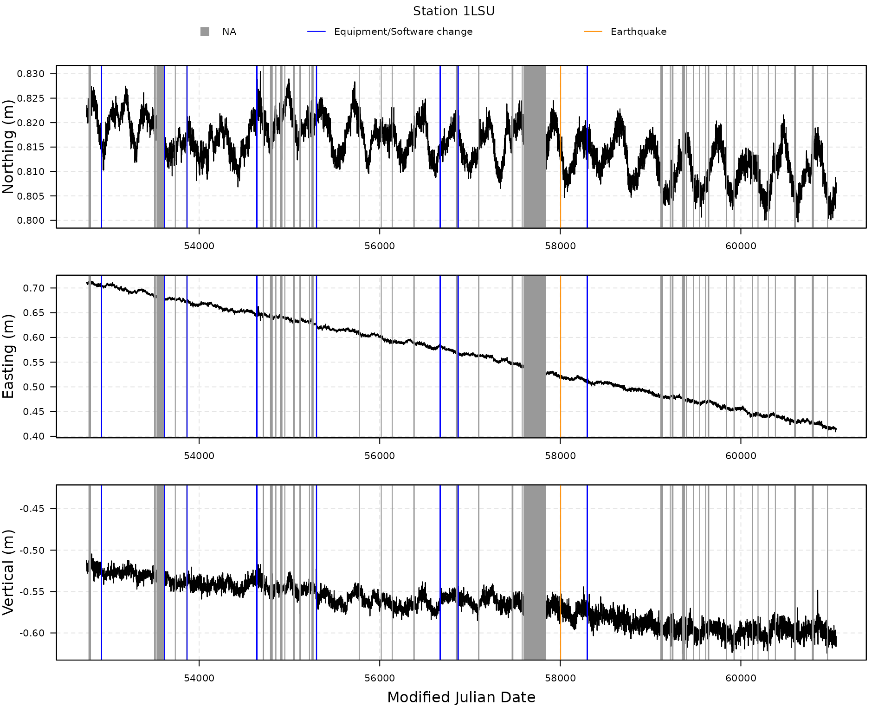
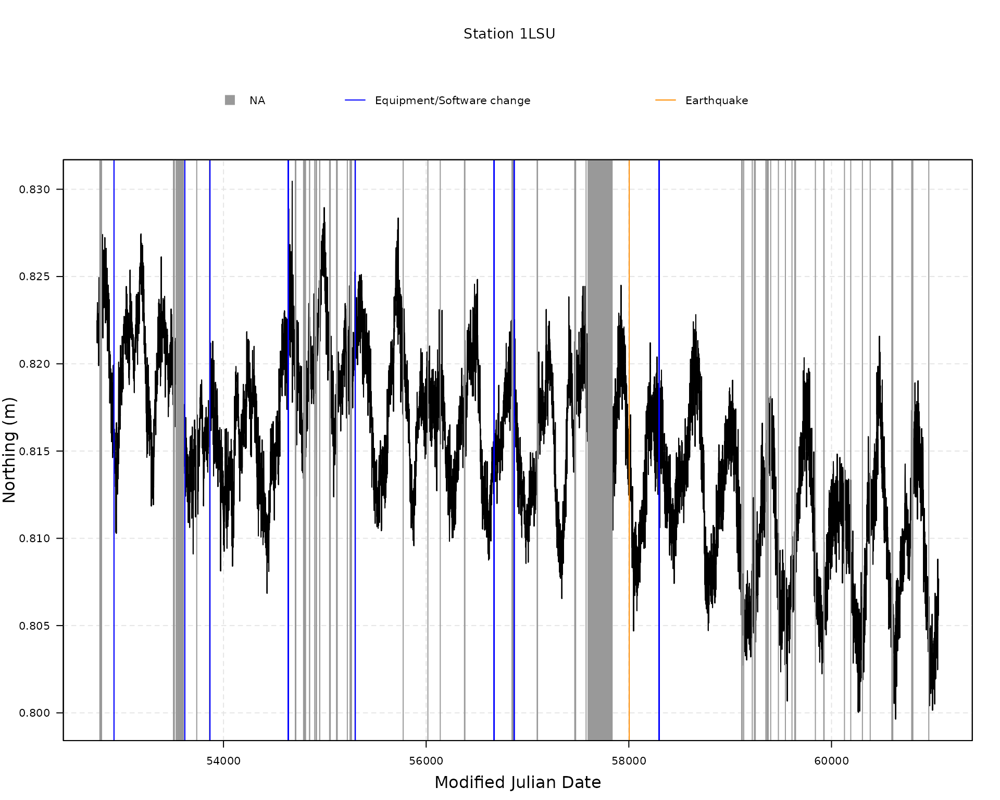
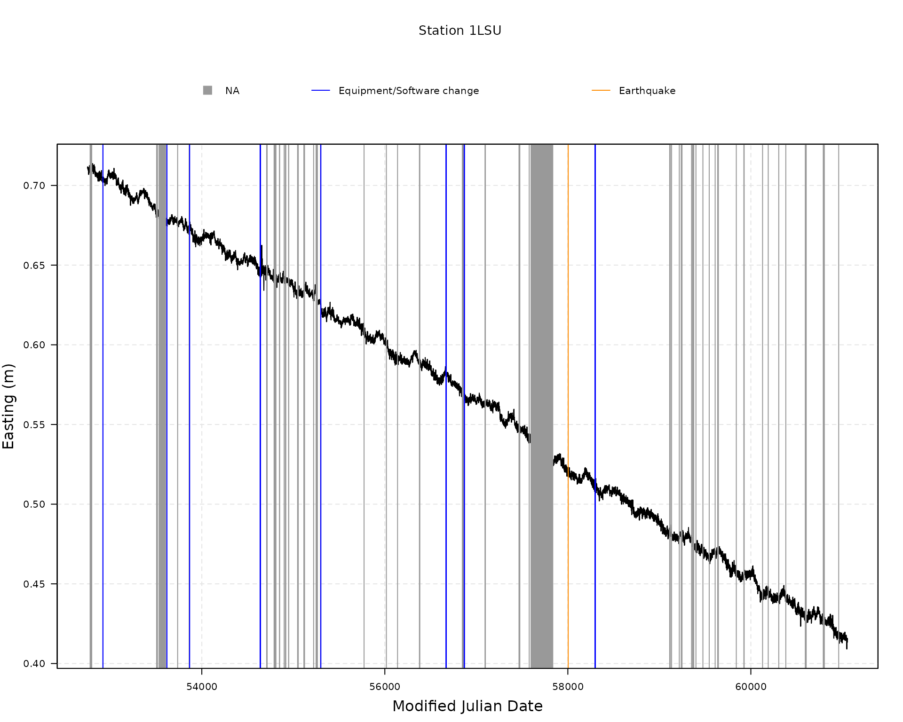
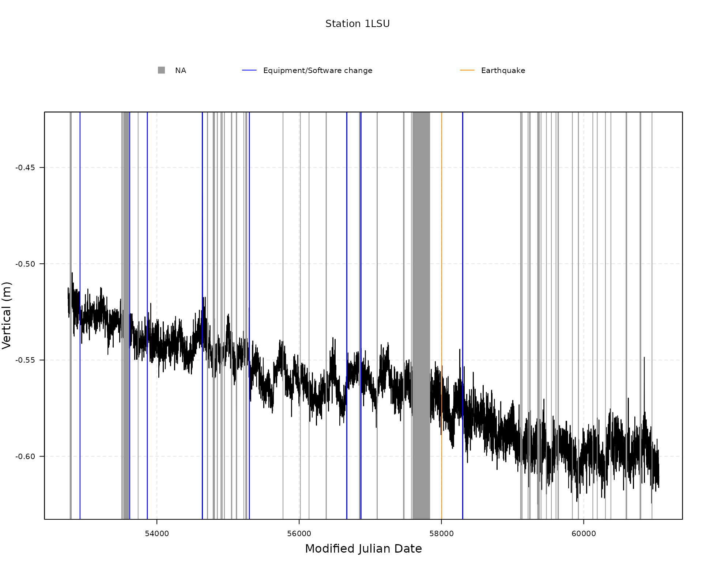

# Load and plot data from Nevada Geodetic Laboratory

Let us first load the `gmwmx2` package.

``` r
library(gmwmx2)
```

## Download all available stations from NGL

``` r
all_stations <- download_all_stations_ngl()
head(all_stations)
```

    ##    station_name  latitude longitude    height
    ##          <char>     <num>     <num>     <num>
    ## 1:         00NA -12.46664 -229.1560 104.85105
    ## 2:         01NA -12.47822 -229.0180 105.40857
    ## 3:         02NA -12.35592 -229.1183 117.65247
    ## 4:         0ABI  68.35434 -341.1836 431.38847
    ## 5:         0ABN  65.03368 -338.6671  52.76211
    ## 6:         0ABY  58.65891 -343.8204  60.54753

## Download one station

``` r
data_1LSU <- download_station_ngl("1LSU")
```

## Extract GNSS position time series of station

``` r
attributes(data_1LSU)
```

    ## $names
    ## [1] "df_position"                   "df_equipment_software_changes"
    ## [3] "df_earthquakes"               
    ## 
    ## $class
    ## [1] "gnss_ts_ngl"

``` r
head(data_1LSU$df_position)
```

    ##    station_name    date decimal_year modified_julian_day gps_week
    ##          <char>  <char>        <num>               <int>    <int>
    ## 1:         1LSU 03APR23     2003.307               52752     1215
    ## 2:         1LSU 03APR24     2003.310               52753     1215
    ## 3:         1LSU 03APR25     2003.313               52754     1215
    ## 4:         1LSU 03APR26     2003.315               52755     1215
    ## 5:         1LSU 03APR27     2003.318               52756     1216
    ## 6:         1LSU 03APR28     2003.321               52757     1216
    ##    day_of_gps_week longitude_reference_meridian eastings_integer_portion
    ##              <int>                        <num>                    <int>
    ## 1:               3                        -91.2                     1896
    ## 2:               4                        -91.2                     1896
    ## 3:               5                        -91.2                     1896
    ## 4:               6                        -91.2                     1896
    ## 5:               0                        -91.2                     1896
    ## 6:               1                        -91.2                     1896
    ##    eastings_fractional_portion northings_integer_portion
    ##                          <num>                     <int>
    ## 1:                    0.710905                   3365278
    ## 2:                    0.711658                   3365278
    ## 3:                    0.710608                   3365278
    ## 4:                    0.710365                   3365278
    ## 5:                    0.710191                   3365278
    ## 6:                    0.709996                   3365278
    ##    northings_fractional_portion vertical_integer_portion
    ##                           <num>                    <int>
    ## 1:                     0.822462                       -6
    ## 2:                     0.822461                       -6
    ## 3:                     0.821198                       -6
    ## 4:                     0.822708                       -6
    ## 5:                     0.823504                       -6
    ## 6:                     0.821861                       -6
    ##    vertical_fractional_portion antenna_height east_sigma north_sigma
    ##                          <num>          <num>      <num>       <num>
    ## 1:                   -0.518135              0   0.000770    0.000826
    ## 2:                   -0.513158              0   0.000814    0.000838
    ## 3:                   -0.512472              0   0.000789    0.000829
    ## 4:                   -0.522002              0   0.000810    0.000851
    ## 5:                   -0.516939              0   0.000810    0.000851
    ## 6:                   -0.519796              0   0.000802    0.000858
    ##    vertical_sigma east_north_correlation east_vertical_correlation
    ##             <num>                  <num>                     <num>
    ## 1:       0.003138              -0.016190                  0.051348
    ## 2:       0.003325              -0.045837                  0.028720
    ## 3:       0.003217              -0.005310                 -0.038035
    ## 4:       0.003332              -0.040613                 -0.025021
    ## 5:       0.003306              -0.002084                  0.023121
    ## 6:       0.003336               0.000188                  0.024412
    ##    north_vertical_correlation nominal_station_latitude
    ##                         <num>                    <num>
    ## 1:                  -0.079018                 30.40742
    ## 2:                  -0.133744                 30.40742
    ## 3:                  -0.065320                 30.40742
    ## 4:                  -0.098485                 30.40742
    ## 5:                  -0.054431                 30.40742
    ## 6:                  -0.068907                 30.40742
    ##    nominal_station_longitude nominal_station_height
    ##                        <num>                  <num>
    ## 1:                 -91.18026               -6.51814
    ## 2:                 -91.18026               -6.51316
    ## 3:                 -91.18026               -6.51247
    ## 4:                 -91.18026               -6.52200
    ## 5:                 -91.18026               -6.51694
    ## 6:                 -91.18026               -6.51980

## Extract equipment or software changes steps

``` r
head(data_1LSU$df_equipment_software_changes)
```

    ##    station_name date_YYMMDD step_type_code           type_equipment_change
    ##          <char>      <char>          <int>                          <char>
    ## 1:         1LSU     03OCT08              1                 Logfile_Changed
    ## 2:         1LSU     05SEP06              1        Elevation_Cutoff_Changed
    ## 3:         1LSU     06MAY11              1 Receiver_Make_and_Model_Changed
    ## 4:         1LSU     08JUN20              1 Antenna_and_Radome_Type_Changed
    ## 5:         1LSU     08JUN23              1        Elevation_Cutoff_Changed
    ## 6:         1LSU     10APR14              1            Antenna_Type_Changed
    ##    modified_julian_date
    ##                   <num>
    ## 1:                52920
    ## 2:                53619
    ## 3:                53866
    ## 4:                54637
    ## 5:                54640
    ## 6:                55300

## Extract earthquakes steps

``` r
head(data_1LSU$df_earthquakes)
```

    ##    station_name date_YYMMDD step_type_code treshold_distance_km
    ##          <char>      <char>          <int>               <char>
    ## 1:         1LSU     17SEP08              2             2041.738
    ##    distance_station_to_epicenter_km event_magnitude usgs_event_id
    ##                               <num>           <num>        <char>
    ## 1:                         1733.135             8.2    us2000ahv0
    ##    modified_julian_date
    ##                   <num>
    ## 1:                58004

## Plot GNSS position time series

``` r
plot(data_1LSU)
```



``` r
plot(data_1LSU, component = "N")
```



``` r
plot(data_1LSU, component = "E")
```



``` r
plot(data_1LSU, component = "V")
```


